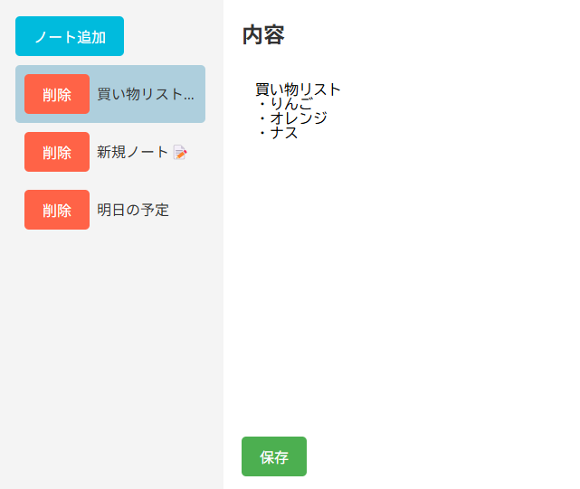

# 📝 memo-app（シンプルなReact製メモアプリ）

## 🔍 概要
このアプリは、Reactを使って作成したシンプルなメモ管理アプリです。  
Firebaseなどの外部サービスを使用せず、ローカルで完結する構成になっています。  
ノートの追加・削除・編集といった基本的な機能をシンプルなUIで体験できます。

## 🛠 使用技術
- React（Hooks）
- ローカル状態管理（useState）
- CSS（シンプルスタイル）
- Git / GitHubでバージョン管理

## ✨ 機能一覧
- ノートの新規追加
- ノートの削除
- ノートの編集・保存
- 選択中のノートがハイライトされる
- UIは直感的でシンプルに設計

## 📷 スクリーンショット


## 📂 プロジェクト構成（抜粋）
src/ ├── App.jsx ├── Appcontext.jsx ├── appMemo.jsx ├── Button.jsx ├── Parent.jsx ├── components/ │ └── AdminFlagProvider.jsx

## 💻 開発環境での動作方法
```bash
git clone https://github.com/Jozet42/memo-app.git
cd memo-app
npm install
npm start

🧪 今後の拡張案
ノートの自動保存機能
カテゴリ・タグ管理
ローカルストレージへの永続化
ダークモード対応

🙌 制作メモ
このアプリは職業訓練校での学習成果のひとつとして作成しました。
シンプルな中にも「状態管理の基本」や「コンポーネントの設計」を意識しています。

## ✍ 使い方（手順）
1. VSCodeで `memo-app/README.md` を開く（無ければ新規作成）
2. 上のテンプレをコピペ
3. 必要に応じて文章や画像パスを調整
4. 保存して `git add README.md`
5. `git commit -m "README追加"` → `git push`
---
## 📝 更新履歴
- 2025/04/15：README.mdの整備とスクリーンショットを追加